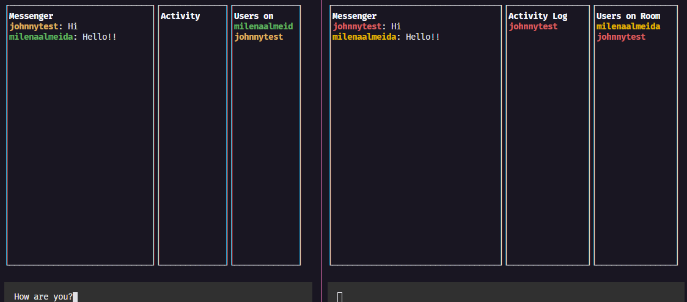

<h1 align="center"> 
    
</h1>

# 💻 Sobre o projeto
Construindo um chat multiplataforma usando linha de comando e JavaScript Avançado, baseado no WeChat. 

Projeto desenvolvido durante a **Semana Javascript Expert** - Oferecido pelo **Erick Wendel**

---

## 🚀 Tecnologias utilizadas
 - [JavaScript](https://www.javascript.com/)
 - [Node](https://nodejs.org/en/)

---

## 🚨 Como baixar o projeto
Antes de começar, você vai precisar ter instalado em sua máquina as seguintes ferramentas: Git, Node.js. Além disto ter um editor para trabalhar com o código como VSCode.

### 🏁 Para rodar a aplicação 

```bash

    # Clonar o repositório
    $ git clone https://github.com/milealmeida/semana-js-expert-hacker-chat

    # Entrar no diretório
    $ cd codigo

    # Instalar as dependências
    $ yarn install

    # Iniciar o projeto
    $ yarn start

```

---
Desenvolvido por Milena Almeida 💙